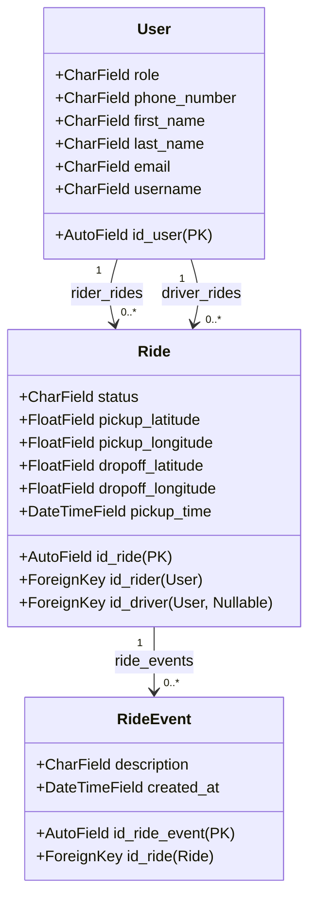

# Architecture & Implementation Report: Rides API

This document details the architectural decisions, database design, optimization strategies, and verification methodologies implemented for the Rides API backend.

---

## 1. Executive Summary

The Rides API is a high-performance Django REST Framework backend designed to manage rides and event logs. It implements strict role-based access control, advanced geo-proximity sorting, and robust query optimization to ensure scalability and database performance.

---

## 2. Requirements & Quick Start

To keep the development environment clean and reproducible, the project relies exclusively on three local dependencies:
- **Docker** (and Docker Compose)
- **GNU Make**
- **Git**

### A. Quick Start
To spin up a fresh, fully seeded local development environment from scratch, execute:
```bash
make all
```
*Note: This command stops existing containers, wipes active volumes, rebuilds the image, runs migrations, seeds initial database records, and starts the server on `http://localhost:8000/`.*

### B. Developer Commands
| Command | Description |
| :--- | :--- |
| `make all` | Full rebuild and environment spin-up from a clean slate. |
| `make migrate` | Applies database migrations (and seeds database on fresh runs). |
| `make test` | Runs the automated pytest suite inside Docker. |
| `make lint` | Performs Ruff check-linting and formatting. |
| `make complexity` | Audits cognitive complexity metrics using Complexipy. |
| `make simulate` | Runs the interactive client simulator to verify API endpoints. |
| `make report` | Runs the raw SQL database report query and prints the table. |

---

## 3. Core Architecture & Schema Design



### A. Custom Auth User Model
* **Decision**: We implemented a custom user model `User` inheriting from `AbstractUser` and registered it via `AUTH_USER_MODEL = "rides.User"`.
* **Rationale**: Inheriting from `AbstractUser` ensures full compatibility with Django's native authentication backend (password hashing, session tracking, permissions) while allowing us to specify custom primary keys (`id_user`), roles (`role`), and phone numbers (`phone_number`) without rewriting core auth libraries.

### B. Relational Integrity
- `Ride.id_rider` binds the ride to its requesting rider.
- `Ride.id_driver` is nullable (`null=True`), as a ride starts as unassigned and is matched to a driver dynamically.
- Cascades are configured with `on_delete=models.CASCADE` to ensure that user deletion handles cleanup without leaving orphan rows.

---

## 4. Query Optimization: Defeating the N+1 Problem

Django REST Framework serializers query relations on a per-row basis. For a page of $N$ rides, fetching related riders, drivers, and ride events would trigger $1 + 2N$ database queries, causing severe database load.

We solved this using two complementary techniques:

### A. Prefetching joined relations
In `views.py`, we overrides the ViewSet `get_queryset` method:
```python
queryset = Ride.objects.select_related("id_rider", "id_driver").prefetch_related("ride_events")
```
- `select_related` joins user tables directly in the primary query.
- `prefetch_related` fetches related ride events in a single batch query.

### B. In-Memory Serializer Method Field Filtering
The API requires returning `todays_ride_events` (events created in the last 24h). 

- **The Problem**: Calling `obj.ride_events.filter(...)` inside a serializer method field discards Django's prefetch cache and triggers an individual SQL query for every single row.
- **The Solution**: We evaluate the prefetch cache in memory:
  ```python
  events = obj.ride_events.all() # Pulls from memory cache
  todays_events = [e for e in events if e.created_at >= time_threshold]
  ```
This guarantees a constant query complexity of **exactly 3 queries** (1 pagination count, 1 rides query, and 1 prefetch query) regardless of pagination size.

---

## 5. Advanced Geo-Proximity Sorting

Sorting rides closest-to-farthest from query coordinates (`near_lat`/`near_lng`) is handled entirely at the database level to support pagination limits and offsets.

Instead of importing heavy geospatial packages (which slow down environments) or using complex trigonometric functions (which vary between PostgreSQL and SQLite), we compute the square of the Euclidean distance ($d^2 = \Delta x^2 + \Delta y^2$) using Django `F` expressions:
```python
distance = (F("pickup_latitude") - lat) * (F("pickup_latitude") - lat) + (F("pickup_longitude") - lng) * (F("pickup_longitude") - lng)
queryset = queryset.annotate(distance=distance).order_by("distance")
```
This is database-agnostic and performs identically on SQLite (testing) and PostgreSQL (production).

---

## 6. Access Control & Security

The API restricts access using a custom permission class `IsAdminRole` protecting the `RideViewSet`:
- Anonymous users are rejected with `401 Unauthorized` or `403 Forbidden`.
- Users with role `rider` are blocked with `403 Forbidden`.
- Users with role `admin` are granted full CRUD access.

We added `"django.contrib.sessions"` and DRF's authentication views (`path("api-auth/", include("rest_framework.urls"))`) to display a **"Log in"** button on the browsable API dashboard, allowing browser sessions to authenticate easily.

---

## 7. Verification Framework

### A. Pytest Suite (`tests/test_rides.py`)
Our automated test suite covers 4 key areas:
1. **Authentication & RBAC**: Asserts unauthorized and rider roles are rejected, while admin roles are allowed.
2. **List & Filtering**: Validates pagination limit/offsets, field nesting structures, and status/email filters.
3. **Advanced Sorting**: Tests pickup time ordering and coordinate distance sorting.
4. **Performance Limits**: Asserts that listing queries never exceed the 3-query budget using `django_assert_num_queries(3)`.

### B. Interactive Client Simulator (`scripts/client_simulator.py`)
A zero-dependency Python script that queries the running server. It handles network fallbacks dynamically (detecting local execution vs Docker internal network routing) and prints a color-coded API call report.

---

## 8. Seeding & SQL Report

### A. Non-Disruptive Seeding
We wrote a Django data migration `0002_seed_data.py` to seed users, rides, and events into the database on fresh migrations. It automatically checks environment variables and skips seeding in automated tests to prevent test database contamination.

### B. Raw SQL Reporting Query
The SQL query calculates trip durations by matching the pickup (`Status changed to pickup`) and dropoff (`Status changed to dropoff`) events, filtering out trips lasting less than 1 hour, and grouping by Month and formatted Driver name:

```sql
SELECT
    TO_CHAR(pickup_event.created_at, 'YYYY-MM') AS "Month",
    CONCAT(driver.first_name, ' ', SUBSTRING(driver.last_name FROM 1 FOR 1)) AS "Driver",
    COUNT(ride.id_ride) AS "Count of Trips > 1 hr"
FROM
    rides_ride ride
JOIN
    rides_user driver ON ride.id_driver_id = driver.id_user
JOIN
    rides_rideevent pickup_event 
        ON ride.id_ride = pickup_event.id_ride_id 
        AND pickup_event.description = 'Status changed to pickup'
JOIN
    rides_rideevent dropoff_event 
        ON ride.id_ride = dropoff_event.id_ride_id 
        AND dropoff_event.description = 'Status changed to dropoff'
WHERE
    dropoff_event.created_at - pickup_event.created_at > INTERVAL '1 hour'
GROUP BY
    TO_CHAR(pickup_event.created_at, 'YYYY-MM'),
    driver.id_user,
    driver.first_name,
    driver.last_name
ORDER BY
    "Month" ASC,
    "Driver" ASC;
```

*Note: You can run `make report` to execute this query against the active database and print the resulting table.*
